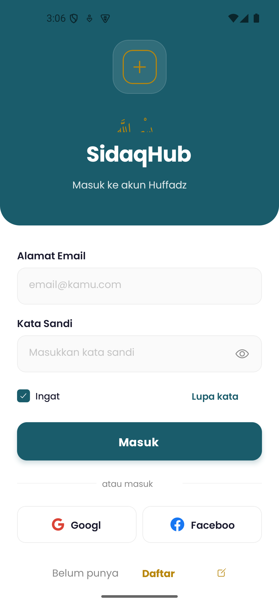
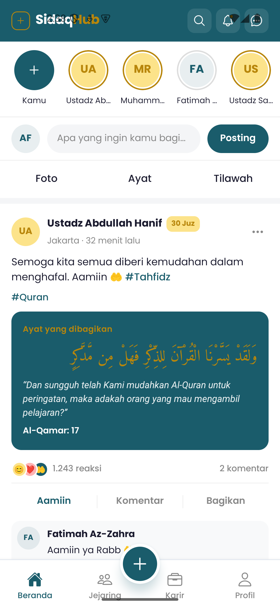
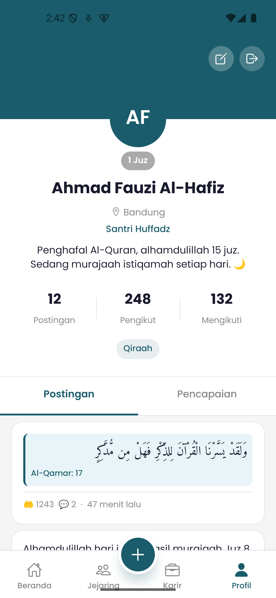

<div align="center">

# 🕌 SidaqHub

### Jejaring Sosial untuk Para Huffadz Indonesia

Aplikasi mobile tempat penghafal Al-Quran saling terhubung, berbagi ayat & tilawah,
mengikuti halaqah, dan menjaga hafalan bersama.

[](https://expo.dev)
[](https://reactnative.dev)
[](https://www.typescriptlang.org)
[](#)

</div>

---

## 📖 Tentang Aplikasi

**SidaqHub** adalah aplikasi sosial yang dirancang khusus untuk komunitas **Huffadz** (penghafal Al-Quran)
di Indonesia. Pengguna dapat berbagi postingan (ayat, teks, tilawah), mengikuti sesama penghafal,
bergabung ke komunitas & halaqah, serta memantau pencapaian hafalan lewat sistem badge Juz.

> 💡 **Status saat ini:** Aplikasi berjalan dalam **mode tanpa backend** — seluruh data menggunakan
> *data dummy lokal* sehingga seluruh tampilan (UI) bisa langsung dijelajahi tanpa server.

---

## ✨ Fitur Utama

| Fitur | Keterangan |
|-------|------------|
| 🏠 **Beranda (Feed)** | Stories, composer, filter (Foto/Ayat/Tilawah), kartu postingan ayat, tilawah, komunitas & pencapaian |
| 🤲 **Reaksi "Aamiin"** | Interaksi khas untuk saling mendoakan antar penghafal |
| 🏘️ **Komunitas & Halaqah** | Gabung komunitas, daftar halaqah online/offline (Zoom, Google Meet) lengkap dengan kuota slot |
| 🔗 **Jejaring** | Temukan & ikuti sesama Huffadz, lihat saran koneksi |
| 🔔 **Notifikasi** | Notifikasi reaksi, komentar, pengikut baru, & pendaftaran halaqah |
| 👤 **Profil** | Statistik, badge Juz, daftar pencapaian, edit profil + ganti foto |
| ✍️ **Buat Konten** | Buat postingan (teks/ayat) & buat halaqah baru |
| 🔐 **Autentikasi** | Alur Login, Register, dan Onboarding 3 langkah |

---

## 📱 Tampilan Aplikasi

<div align="center">

| Login | Beranda | Profil |
|:-----:|:-------:|:------:|
|  |  |  |

</div>

---

## 🛠️ Teknologi

- **[Expo](https://expo.dev) ~54** — framework React Native
- **[React Native](https://reactnative.dev) 0.81** + **React 19**
- **[Expo Router](https://docs.expo.dev/router/introduction) ~6** — navigasi berbasis file (*file-based routing*)
- **[TypeScript](https://www.typescriptlang.org) ~5.9**
- **React Navigation** (Bottom Tabs + Native Stack)
- **Font:** Poppins (UI) & Amiri (teks Arab)
- **EAS Build** — untuk membuat APK

---

## 📂 Struktur Proyek

```
SidaqHubApp/
├── app/                      # Semua layar & rute (file-based routing)
│   ├── (auth)/               # Login, Register, Onboarding
│   ├── (tabs)/               # Beranda, Jejaring, Komunitas, Notifikasi, Profil
│   ├── post/                 # Detail & buat postingan
│   ├── halaqah/              # Detail & buat halaqah
│   ├── user/[id].tsx         # Profil pengguna lain
│   └── edit-profile.tsx
├── context/AuthContext.tsx   # State autentikasi (auto-login dummy)
├── utils/
│   ├── api.ts                # Lapisan API (mock resolver, tanpa backend)
│   └── mock.ts               # 📦 Sumber data dummy lokal
├── constants/theme.ts        # Warna, font, spacing, helper
├── assets/                   # Gambar, ikon, splash
└── docs/screenshots/         # Tangkapan layar
```

---

## 🚀 Cara Menjalankan

### Prasyarat
- [Node.js](https://nodejs.org) 18+
- Aplikasi **[Expo Go](https://expo.dev/go)** di HP, atau **Android Studio / Xcode** untuk emulator

### Langkah
```bash
# 1. Install dependencies
npm install

# 2. Jalankan aplikasi
npx expo start
```

Lalu pilih salah satu di terminal:
- Tekan **`a`** → buka di **Android** (emulator/perangkat)
- Tekan **`i`** → buka di **iOS Simulator**
- Tekan **`w`** → buka di **Web**
- Atau **scan QR code** dengan aplikasi Expo Go

> ℹ️ Aplikasi langsung masuk ke Beranda (auto-login). Untuk melihat alur Login/Register/Onboarding,
> buka tab **Profil → ikon Logout** di pojok kanan atas.

---

## 📦 Build APK (Android)

Aplikasi di-build menggunakan **[EAS Build](https://docs.expo.dev/build/introduction/)**.

```bash
# Login ke akun Expo (sekali saja)
npx eas-cli login

# Build APK release yang siap dibagikan
npx eas-cli build --platform android --profile preview
```

Setelah selesai (~10–20 menit), kamu akan mendapat **link download `.apk`** yang bisa
langsung di-install ke perangkat Android tanpa perlu dev server.

| Info Build | Nilai |
|------------|-------|
| Application ID | `com.sidaqhub.app` |
| Profil build | `preview` (APK · *internal distribution*) |
| Versi | `1.0.0` |

---

## 🗺️ Status & Rencana

- [x] Seluruh UI (20 layar) selesai
- [x] Mode demo dengan data dummy lokal
- [x] Build APK Android
- [ ] Integrasi backend (API nyata)
- [ ] Autentikasi & notifikasi *real-time*
- [ ] Rilis ke Google Play Store

---

<div align="center">

Dibuat dengan ❤️ untuk para penghafal Al-Quran Indonesia

</div>
